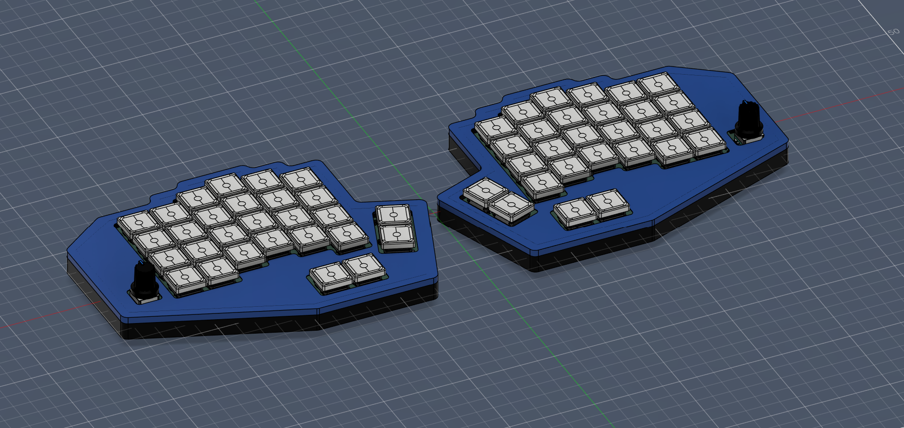
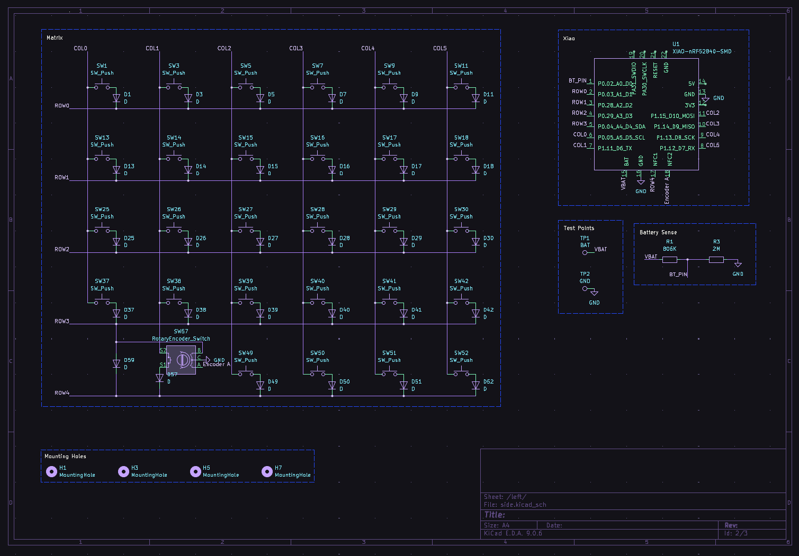
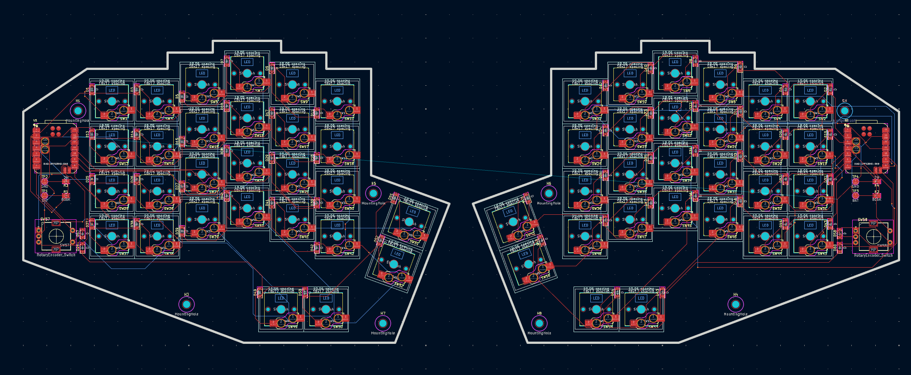
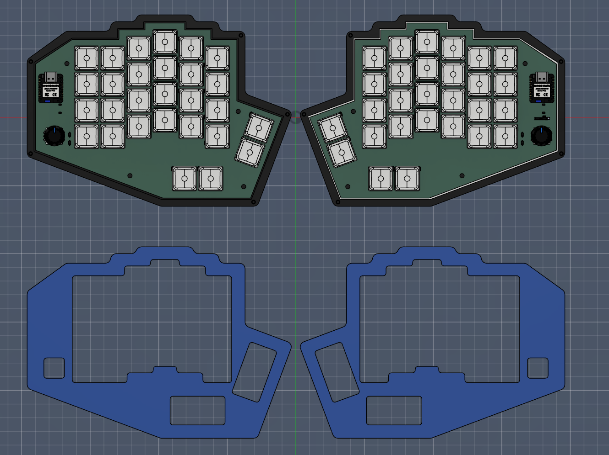

# Split-Keyboard
A custom **split keyboard** project built with kicad, fusion 360 and kmk.
---

## Project Overview

This keyboard is a **split design**, fully programmable using KMK firmware. The goal was to design something that would provide a decent typing experience and replace my current keyboard.
---

## Screenshots

### 1. Overall
  

### 2. Schematic
  

### 3. PCB layout
  

### 4. Case Assembly
  

### Bill Of Materials

| Item | Description | Qty | Unit Price (AUD) | Total Price (AUD) | URL | Running Total (AUD) | USD |
|------|------------|-----|------------------|-------------------|-----|---------------------|-----|
| Kailh Choc Hotswap Socket x10 | Hotswap socket | 60 | $0.15 | $9.00 | https://www.alibaba.com/product-detail/Hotswap-Sockets-PCB-Hot-Swap-Socket_1601586781518.html | $9.00 | $5.94 |
| Rotary Encoder Module EC11 | Rotary encoder with knob | 2 | $0.43 | $0.86 | Create idea 5 Kits of 360 Degree Rotary Encoder Modules EC11 Digital Potentiometer Push Button Switch – Amazon AU | $9.86 | $6.51 |
| Rotary Encoder Control Button Knob | Rotary encoder knob | 2 | $0.92 | $1.84 | https://www.alibaba.com/product-detail/ALUMINUM-Matte-Black-Diameter-13mm-Rotary_1601317368755.html | $11.70 | $7.73 |
| Kailh Low Profile Choc Brown (30 pack) | Switches | 2 | $37.99 | $75.98 | KAILH Official Store Low Profile Switch 1350 Chocolate Mechanical Keyboard Switch RGB SMD Clicky (Choc Brown) | $85.84 | $56.68 |
| Kailh CHOC Slim Keycaps – Milky White | Keycaps | 60 | $0.53 | $31.80 | https://www.alibaba.com/product-detail/Chosfox-CFX-Low-Profile-Choc-PBT_1601568672382.html | $117.64 | $77.68 |
| 402050 LiPo Battery | Battery | 2 | $3.80 | $7.60 | https://www.aliexpress.com/p/tesla-landing/index.html?productId=32662701530 | $125.24 | $82.70 |
| JLCPCB Manufacturing | PCB | 2 | $13.00 | $26.00 | https://cart.jlcpcb.com/quote | $151.24 | $99.87 |
| 3D Printed Case | Case | 1 | – | – | – | $151.24 | $99.87 |

